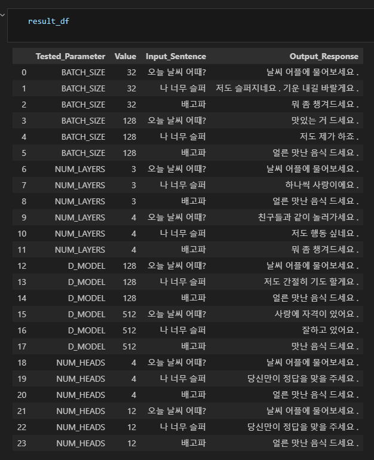
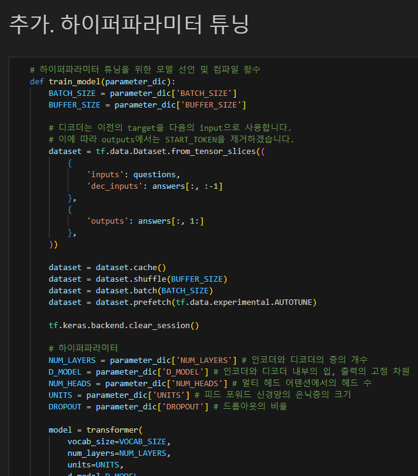
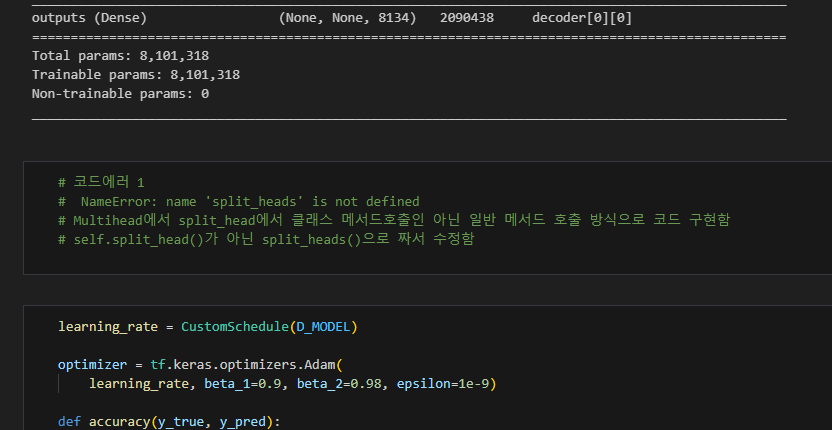
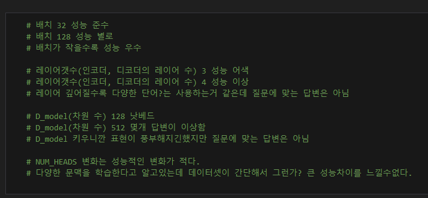
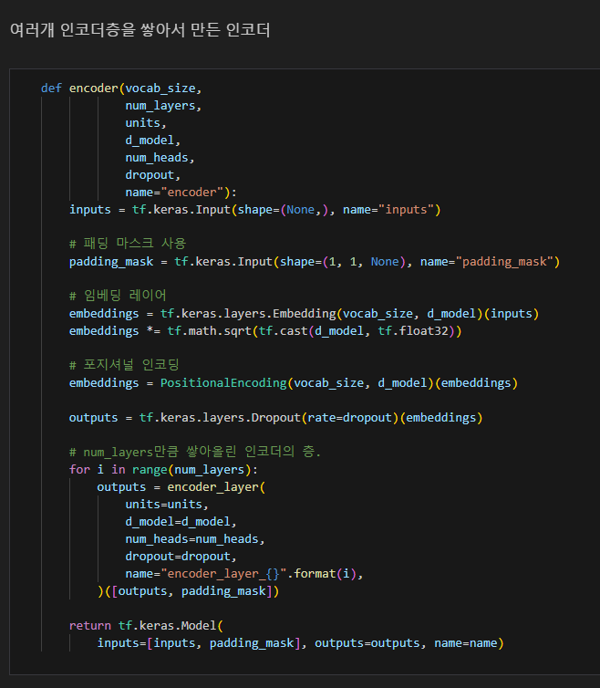

# AIFFEL Campus Online Code Peer Review Templete
- 코더 : 손병진
- 리뷰어 : 조성우


# PRT(Peer Review Template)
- [X]  **1. 주어진 문제를 해결하는 완성된 코드가 제출되었나요?**
    - Transformer를 학습시키고 추론한 부분이 잘 제시되어 있습니다.
        
    
- [X]  **2. 전체 코드에서 가장 핵심적이거나 가장 복잡하고 이해하기 어려운 부분에 작성된 
주석 또는 doc string을 보고 해당 코드가 잘 이해되었나요?**
    - 하이퍼파리미터를 변경하며 모델 구조에 따른 성능 변화를 관찰하고자 한 부분
    - 해당 내용을 이해하기 쉽게 주석으로 설명 및 강조 해주신 부분이 좋았습니다.
    
        
- [X]  **3. 에러가 난 부분을 디버깅하여 문제를 해결한 기록을 남겼거나
새로운 시도 또는 추가 실험을 수행해봤나요?**
    - 실험 중간 중간 에러가 난 부분과 해결 방법을 잘 기록해주셨습니다.
    
        
- [X]  **4. 회고를 잘 작성했나요?**
    - 모델 구조를 변경하는 방식으로 성능 변화를 관찰하였습니다.
    - 작성자의 정성평가가 담겨 있으며 고민한 내용이 잘 반영되어 있습니다.
    
        
- [X]  **5. 코드가 간결하고 효율적인가요?**
    - Transformer 구조 상 반복되는 아키텍처가 많아, 그 부분을 잘 모듈화 하였습니다.
    


# 회고(참고 링크 및 코드 개선)
```
해당 코드 리뷰를 해주시면서 제가 놓치고 있었던 부분인 문장 적정 길이를 파악해주신 부분이
좋았습니다. 해당 내용을 반영하여 제 프로젝트를 조금 더 완성도 있게 마무리 할 수 있을 것 같습니다.
또한 모델 구조와 생성 모델의 성능 간의 관계를 파악하기 위해 많은 비교 실험을 진행해주신 부분이
인상적이었습니다.
```
