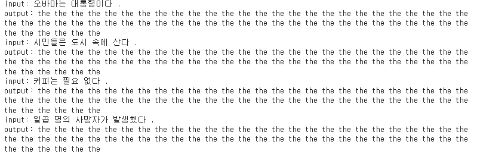
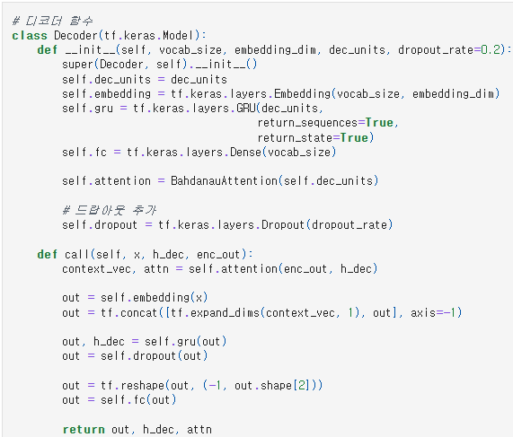
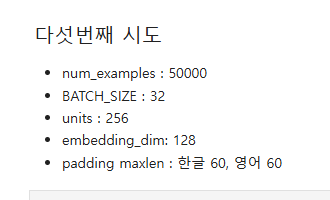
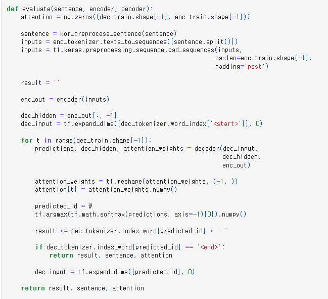

# AIFFEL Campus Online Code Peer Review Templete
- 코더 : 손병진
- 리뷰어 : 염철헌


# PRT(Peer Review Template)
- [x]  **1. 주어진 문제를 해결하는 완성된 코드가 제출되었나요?**
    - 문제에서 요구하는 최종 결과물이 첨부되었는지 확인
        - 중요! 해당 조건을 만족하는 부분을 캡쳐해 근거로 첨부
        - 결과 코드를 제출하긴 하였지만, 만족스러운 결과는 아님. 토큰이 중복되어 생성하는 방식으로 크로스엔트로피가 갇힘
        - 
    
- [X]  **2. 전체 코드에서 가장 핵심적이거나 가장 복잡하고 이해하기 어려운 부분에 작성된 
주석 또는 doc string을 보고 해당 코드가 잘 이해되었나요?**
    - 해당 코드 블럭을 왜 핵심적이라고 생각하는지 확인
    - 해당 코드 블럭에 doc string/annotation이 달려 있는지 확인
    - 해당 코드의 기능, 존재 이유, 작동 원리 등을 기술했는지 확인
    - 주석을 보고 코드 이해가 잘 되었는지 확인
        - 중요! 잘 작성되었다고 생각되는 부분을 캡쳐해 근거로 첨부
        - 드랍아웃을 모델에 추가로 삽입한 것을 주석으로 표가
        - 
        
- [X]  **3. 에러가 난 부분을 디버깅하여 문제를 해결한 기록을 남겼거나
새로운 시도 또는 추가 실험을 수행해봤나요?**
    - 문제 원인 및 해결 과정을 잘 기록하였는지 확인
    - 프로젝트 평가 기준에 더해 추가적으로 수행한 나만의 시도, 
    실험이 기록되어 있는지 확인
        - 중요! 잘 작성되었다고 생각되는 부분을 캡쳐해 근거로 첨부
        - 각 시도마다 하이퍼파라미터를 기입
        - 
        - 
        
- [X]  **4. 회고를 잘 작성했나요?**
    - 주어진 문제를 해결하는 완성된 코드 내지 프로젝트 결과물에 대해
    배운점과 아쉬운점, 느낀점 등이 기록되어 있는지 확인
    - 전체 코드 실행 플로우를 그래프로 그려서 이해를 돕고 있는지 확인
        - 중요! 잘 작성되었다고 생각되는 부분을 캡쳐해 근거로 첨부
        - 회고와 해결하지 못 한 부분이 서로 잘 피드백에서 오고갔음
        - 
        
- [X]  **5. 코드가 간결하고 효율적인가요?**
    - 파이썬 스타일 가이드 (PEP8) 를 준수하였는지 확인
    - 코드 중복을 최소화하고 범용적으로 사용할 수 있도록 함수화/모듈화했는지 확인
        - 중요! 잘 작성되었다고 생각되는 부분을 캡쳐해 근거로 첨부
        - 함수화 하였기 때문에 적절한 코드만 불러와도 모델 실행 가능
        - 


# 회고(참고 링크 및 코드 개선)
```
# 저와는 다르게 데이터 전처리 부분을 굉장히 강조해서 해결하셨는데, 저는 이 부분이 부족했던지라 여러 궁금점을 해결하고 인사이트를 얻어갔습니다.
# 모델에서 부족한 부분을 피어리뷰 하는 과정에서 알게 되셨고 다음에는 적용하실 수 있을 것으로 보입니다.
```
